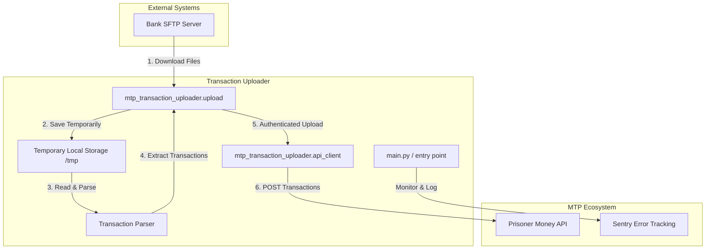

# Project Overview

The **Transaction Uploader** is a background service (run as a cron job) responsible for retrieving bank transaction files, parsing them, and uploading the relevant data to the Prisoner Money API. It acts as a bridge between the bank's data services and the MTP ecosystem, facilitating the reconciliation of prisoner funds.

## Core Functionality

1.  **SFTP Retrieval**: Periodically connects to a bank's SFTP server to download new transaction files (Data Services files).
2.  **File Parsing**: Processes the downloaded files, which typically contain structured bank account information.
3.  **Transaction Filtering**: Extracts and filters transactions based on specific account codes and relevant criteria.
4.  **Data Extraction**: Identifies key details from each transaction:
    *   **Prisoner Details**: Extracting names and numbers to identify the intended recipient.
    *   **Sender Information**: Capturing details about the person sending the money.
    *   **Settlement Mapping**: Matching transactions to specific settlement batches for reconciliation.
5.  **API Upload**: Authenticates with the MTP API using OAuth2 and uploads the processed transactions for further processing by the Cashbook and other MTP services.
6.  **Monitoring**: Integrates with Sentry for error tracking and uses ELK-compatible logging for monitoring execution.

## Architectural Components

The following diagram illustrates the data flow and the key architectural components involved in the transaction uploading process:

## Data Processing Pipeline

1.  **Trigger**: The application is invoked (usually via `cron`).
2.  **Authentication**: The `api_client` fetches an OAuth2 token from the API.
3.  **Sync**: `upload.py` checks for new files on the SFTP server.
4.  **Process**:
    *   Files are downloaded to a local temporary directory.
    *   The parser iterates through each file, extracting transaction records.
    *   Records are cleaned and enriched with metadata (prisoner/sender info).
5.  **Upload**: Batches of transactions are sent to the API.
6.  **Cleanup**: Local temporary files are managed, and the process completes.
